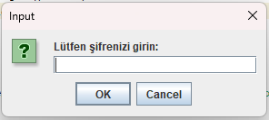
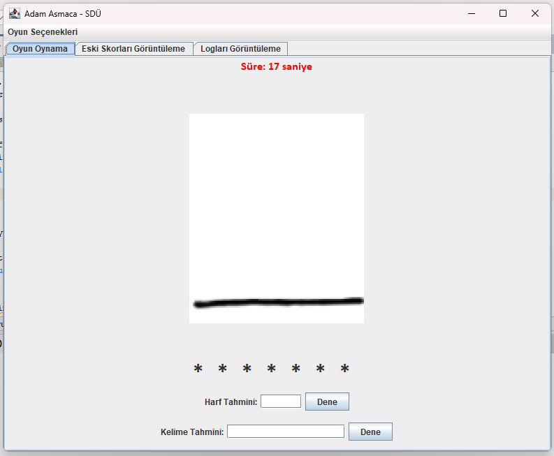
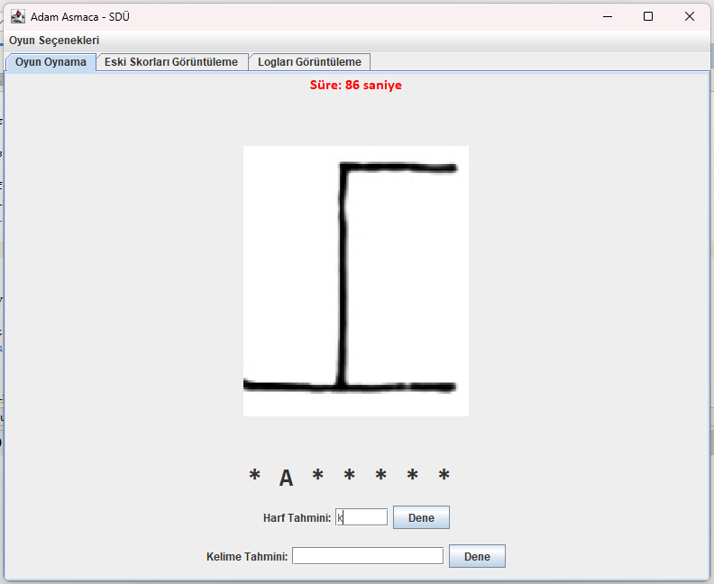
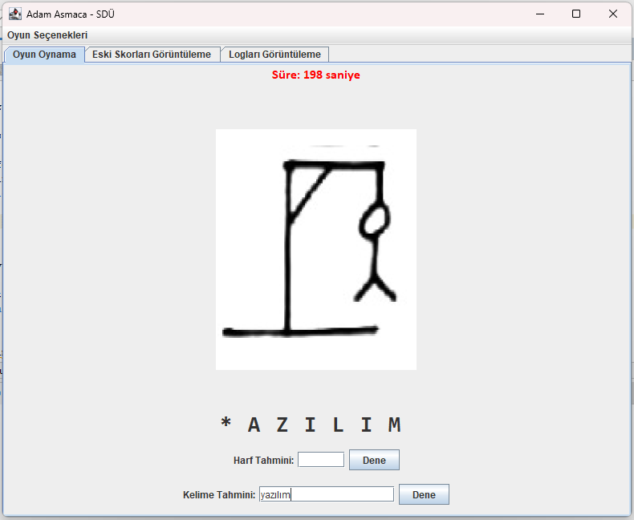
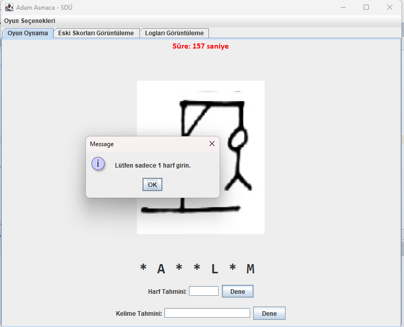
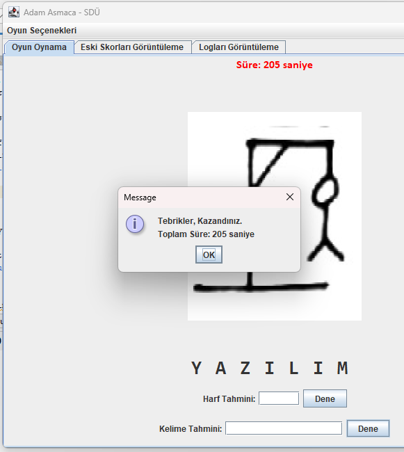
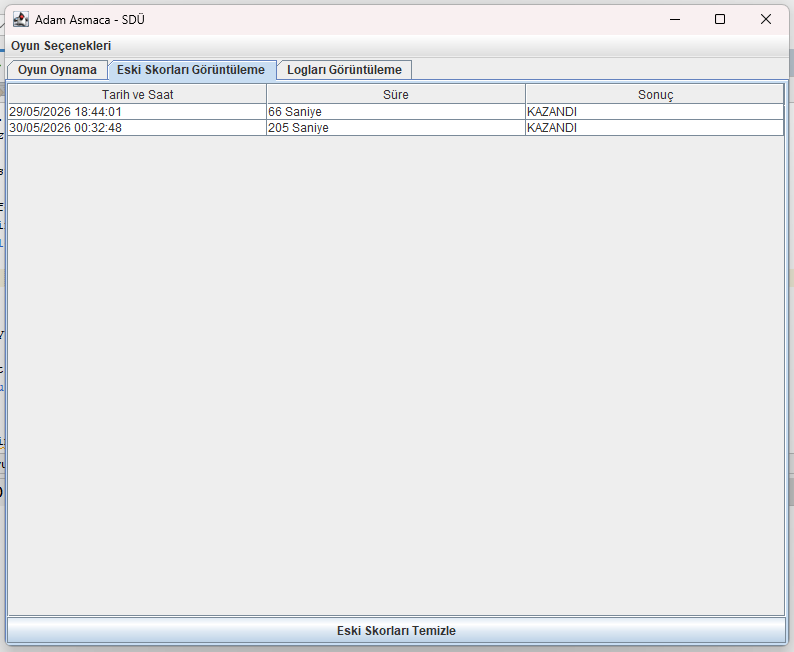
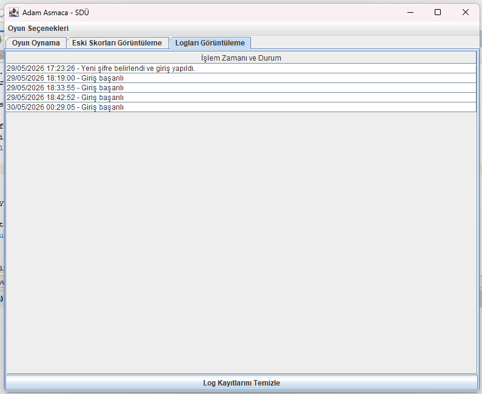

# 🎮 Adam Asmaca Oyunu (Java Swing)

Süleyman Demirel Üniversitesi Bilgisayar Mühendisliği Bölümü Java GUI (Swing) eğitimi kapsamında geliştirilmiş, dosya okuma/yazma (File I/O) mimarisine dayanan masaüstü Adam Asmaca oyunudur. 

## 📸 Projeden Ekran Görüntüleri

**Şifre Belirleme ve Giriş Ekranı**
 
 
  

**Oyun İçi (Harf ve Kelime Tahmini)**
 
 
  

**Hata Uyarıları ve Oyun Sonucu**
 
 
  

**Veri Listeleme (Skorlar ve Loglar)**
 
 
 

---

## 🚀 Proje Özellikleri

* **Güvenli Giriş Sistemi:** `sifre.txt` dosyası üzerinden veri kontrolü sağlanan giriş paneli.
* **Sistem Loglama:** Her giriş ve hatalı deneme işleminin tarih/saat damgasıyla `log.txt` dosyasına kaydedilmesi.
* **Dinamik Oyun Motoru:** `kelimeler.txt` içerisinden rastgele seçilen verilerin dinamik olarak maskelenmesi ve anlık tahmin kontrolü.
* **Görsel Takip ve Zamanlayıcı:** Yapılan her hatalı tahminde 11 adımlı adam asmaca görsellerinin sırayla render edilmesi ve `javax.swing.Timer` ile eşzamanlı süre takibi.
* **Veri Listeleme (JTable):** Oyun bittiğinde sonucun `oyunlar.txt` dosyasına yazılması ve JTabbedPane altındaki sekmelerde düzenli bir tablo (JTable) olarak listelenmesi.

## 🛠️ Kullanılan Teknolojiler

* **Programlama Dili:** Java
* **Kullanıcı Arayüzü (GUI):** Java Swing (JFrame, JPanel, DefaultTableModel vb.)
* **Veri Yönetimi:** File I/O (BufferedReader, FileWriter)

## ⚙️ Kurulum ve Çalıştırma Yönergeleri

Projenin yerel ortamda sorunsuz çalışabilmesi için sabit dosya yollarının ayarlanması gerekmektedir:

1. `C:\` dizini içerisinde `P2Oyun` adında bir kök klasör oluşturun.
2. Bu klasörün içerisine `Resimler` (1.jpg - 11.jpg arası dosyalar için) ve `TXTDosyalar` adında iki klasör ekleyin.
3. `TXTDosyalar` klasörünün içerisine `log.txt`, `oyunlar.txt`, `sifre.txt` ve içeriği doldurulmuş `kelimeler.txt` dosyalarını yerleştirin.
4. Program ilk çalıştırıldığında arayüz üzerinden otomatik olarak yeni şifre belirlemenizi isteyecektir.
